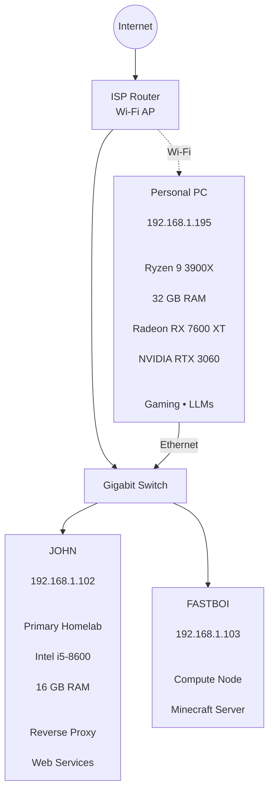

# test

```mermaid
flowchart TB
    Internet((Internet))

    Router["ISP Router<br/>Wi-Fi AP"]

    Switch["Gigabit Switch"]

    PC["Personal PC<br/>
    192.168.1.195<br/><br/>
    Ryzen 9 3900X<br/>
    32 GB RAM<br/>
    Radeon RX 7600 XT<br/>
    NVIDIA RTX 3060<br/><br/>
    Gaming • LLMs"]

    JOHN["JOHN<br/>
    192.168.1.102<br/><br/>
    Primary Homelab<br/>
    Intel i5-8600<br/>
    16 GB RAM<br/><br/>
    Reverse Proxy<br/>
    Web Services"]

    FAST["FASTBOI<br/>
    192.168.1.103<br/><br/>
    Compute Node<br/>
    Minecraft Server"]

    Internet --> Router
    Router --> Switch
    Router -. Wi-Fi .-> PC
    PC -->|Ethernet| Switch

    Switch --> JOHN
    Switch --> FAST
```
