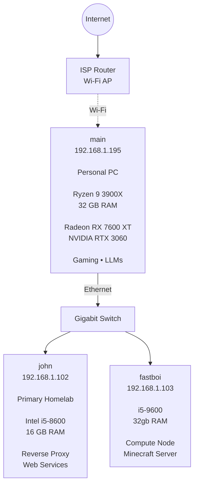

# General Overview

# Firewall/Router

Nothing fancy. My NAT configs drop everything by default. To be more concise, I am using nftables on my main pc as a NAT router. I forward my server's ips from my main pc. Its not ideal. My main pc is also a dual boot so my servers disconnect from the internet when using windows. I just don't have a dedicated router setup yet. The orange pi 3b below that I had laying around is what I plan on using as a router.

# Docker

| Container | Purpose | server |
|------------|-------------|------------|
| [Vaultwarden](https://github.com/dani-garcia/vaultwarden) | password manager | john |
| [Navidrome](https://www.navidrome.org/) | music streaming service | john |
| [Gotify](https://gotify.net/) | push notification via rest-api | john |
| [Open-WebUI](https://docs.openwebui.com/) | a front end for LLMs | john |
| [Immich](https://immich.app/) | basically better google photos | john |
| [Caddy](https://caddyserver.com/) | reverse proxy | john |
| [Searxng](https://docs.searxng.org/) | combines search engines for llm use | john |
| [ConvertX](https://github.com/C4illin/ConvertX) | video format converter using ffmpeg | john |
| [Minecraft](https://docker-minecraft-server.readthedocs.io/en/latest/) | its minecraft | fastboi |
| [TTS](https://github.com/remsky/Kokoro-FastAPI) | text to speech translator | main |
| [llama-cpp](https://github.com/ggml-org/llama.cpp) | LLM interface | main |

For every service a docker compose file sits inside its own directory. Most of them use mount folders from within the directory. Unless I decide there is enough of a performance benefit to use docker volumes.

# LLM Overview

Open-WebUI serves as the frontend for using any LLMs. Anytime the LLMs use the web they use searxng. The LLMs themselves are loaded on my main pc's gpus(3060 12gb, 7600xt 16gb).

Models commonly used:

- [unsloth/gemma-4-12b-it-GGUF](https://huggingface.co/unsloth/gemma-4-12b-it-GGUF)
- [unsloth/Qwen3.5-9B-GGUF](https://huggingface.co/unsloth/Qwen3.5-9B-GGUF)

# Monitoring

   
Its a standard prometheus and grafana combo. In grafana using webhooks with gotify I made alerts for services that went down or spiked a concerning amount. It also lets me know if I am running out of ram(used to be a bigger issue).

# Security

Beyond tirelessly inspecting linux folder/file permissions, dedicated users for services and basic linux server hardening(no password ssh, kernel hardening, etc.). I have yet to setup a proper security monitoring service like [Falco](https://falco.org/). I have already setup a simple script that looks for any new ssh connections and sends me a alert. But anything that happens within docker containers is a huge blind spot for me right now.
